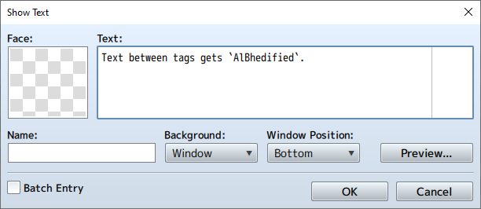
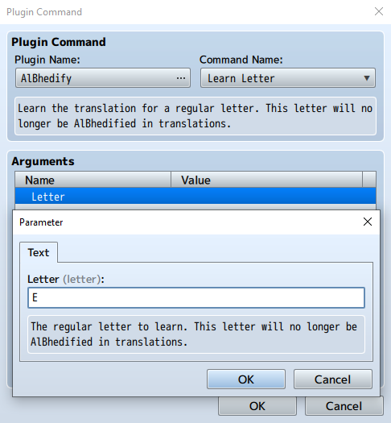

# AlBhedify

*An RPG Maker MZ plugin that translates text into an in-game language a la FFX's Al Bhed*

## Installation

1. Go to the [Releases](https://github.com/corvinedev/AlBhedify/releases/) page and locate the most recent release: `v1.0.0`
2. Download `AlBhedify.js`
3. Save or copy `AlBhedify.js` to `/plugins` in your project folder
4. Inside the editor, open the plugin manager and add **AlBhedify**
5. Place AlBhedify before any other plugins that modify windows or messages
6. Configure the plugin parameters - **at the very least, open the `Language Map` parameter and press "OK"**

## Example

In the following example, all plugin settings are set to the defaults.

In any message where regular control codes (such as color codes or actor names) are available, text surrounded by the `Open Tag` and `Close Tag` will get "AlBhedified". In this case, both the `Open Tag` and `Close Tag` are set to the backtick character `` ` ``, and the `Language Map` is set to the default values (FFX's Al Bhed language).

To learn a letter, the plugin command `Learn Letter` is used. In this example, the regular letter `E` is learned.

Now the letter `E` will no longer be AlBhedified. The message from before will show up in-game with the regular letter, and it will no longer be highlighted.

## Commands

### Learn Letter

Learn the translation for a regular letter. This letter will no longer be AlBhedified in translations.

### Forget Letter

Forget the translation for a regular letter. This letter will be AlBhedified in translations.

### Set Color Options

Set and modify options for highlighting AlBhedified letters. You can disable color coding of translations with this command, and you can change the color code used to highlight AlBhedified letters and the normal color code used for regular letters.

**This should probably be 0. Keep in mind that if the last character in a translated section of text was AlBhedified, and `Use Color` is `true`, then any text following the `Close Tag` will get rendered with the color code for `Normal Color`.**

### Set Tags

Set `Open Tag` and `Close Tag`.

### Letter Known?

Set a switch depending on whether a letter is known. If the regular letter provided as an argument is known (i.e. if that regular letter is no longer AlBhedified), then the switch provided as an argument will be set to `ON`. Otherwise, the switch will be set to `OFF`.

## Caveats

- This plugin should probably be placed before any other plugins that modify text and window behavior.
- Be sure to set the `Language Map` parameter in the plugin settings, *even if you just want to use the default language map*. If you don't at least open up the parameter editor and press "OK", you'll get the following error when you start the game: `Unexpected end of JSON input`.
- Most control codes can be used inside translation tags. These include (among others):
  - Variable value: `\V[n]`
  - Actor name: `\N[n]`
  - Party member name: `\P[n]`
  - Currency unit: `\G`
  - Increase font size: `\{`
  - Decrease font size: `\}`
- Some other control codes can **NOT** be used inside translation tags, because they will get AlBhedified and won't work. Specifically, these control codes can't go inside translation tags:
  - Color code: `\C[n]`
  - Set position: `\PX[n]` and `\PY[n]`
  - Set font size: `\FS[n]`
  - Display icon: `\I[n]`
- When the `Use Colors` parameter is `true`, this plugin will add color control codes (`\C[n]`) into the translated text. If the last character in the translated text is AlBhedified, then the `Normal Color` color code will get added after it to ensure that any text after the translated text is rendered in the normal text color.
