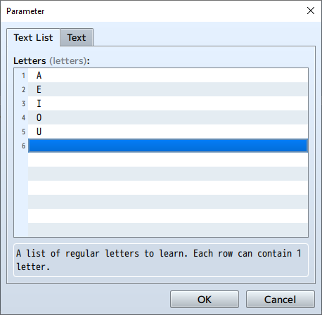

# AlBhedify

*An RPG Maker MZ plugin that translates text into an in-game language a la FFX's Al Bhed*

## Installation

1. Go to the [Releases](https://github.com/corvinedev/AlBhedify/releases/) page and locate the most recent release: `v1.0.1`
2. Download `AlBhedify.js`
3. Save or copy `AlBhedify.js` to `/js/plugins/` in your project folder
4. Inside the editor, open the plugin manager and add **AlBhedify**
5. Place AlBhedify before any other plugins that modify windows or messages
6. Configure the plugin parameters - **at the very least, open the `Language Map` parameter and press "OK"**

## Example

In the following example, all plugin settings are set to the defaults.

In any message where regular control codes (such as color codes or actor names) are available, text surrounded by the `Open Tag` and `Close Tag` will get "AlBhedified". In this case, both the `Open Tag` and `Close Tag` are set to the backtick character `` ` ``, and the `Language Map` is set to the default values (FFX's Al Bhed language).

To learn a letter, the plugin command `Learn Letter` is used. In this example, the regular letter `E` is learned.

Now the letter `E` will no longer be AlBhedified. The message from before will show up in-game with the regular letter, and it will no longer be highlighted.

## Commands

### Learn Letter

Learn the translation for a regular letter. This letter will no longer be AlBhedified in translations.

### Learn Multiple Letters

Learn the translations for a list of regular letters.

### Forget Letter

Forget the translation for a regular letter. This letter will be AlBhedified in translations.

### Forget Multiple Letters

Forget the translations for a list of regular letters.

### Set Color Options

Set and modify options for highlighting AlBhedified letters. You can disable color coding of translations with this command, and you can change the color code used to highlight AlBhedified letters and the normal color code used for regular letters.

**`Normal Color` should probably be 0. Keep in mind that if `Use Color` is set to `true`, then the color code for the normal color will be placed after the last AlBhedified character.**

### Set Tags

Set `Open Tag` and `Close Tag`.

### Letter Known?

Set a switch depending on whether a letter is known. If the regular letter provided as an argument is known (i.e. if that regular letter is no longer AlBhedified), then the switch provided as an argument will be set to `ON`. Otherwise, the switch will be set to `OFF`.

### Multiple Letters Known?

Set a switch depending on whether all letters in a list of letters are known. If every letter in the list is known, then the switch provided as an argument will be set to `ON`. If *any* letter in the list is not known, then the switch will be set to `OFF`.

## Caveats

- This plugin should probably be placed before any other plugins that modify text and window behavior.
- Be sure to set the `Language Map` parameter in the plugin settings, *even if you just want to use the default language map*. If you don't at least open up the parameter editor and press "OK", you'll get the following error when you start the game: `Unexpected end of JSON input`.
- Most control codes can be used inside translation tags. These include (among others):
  - Variable value: `\V[n]`
  - Actor name: `\N[n]`
  - Party member name: `\P[n]`
  - Currency unit: `\G`
  - Increase font size: `\{`
  - Decrease font size: `\}`
- Some other control codes can **NOT** be used inside translation tags, because they will get AlBhedified and won't work. Specifically, these control codes can't go inside translation tags:
  - Color code: `\C[n]`
  - Set position: `\PX[n]` and `\PY[n]`
  - Set font size: `\FS[n]`
  - Display icon: `\I[n]`
- When the `Use Colors` parameter is `true`, this plugin will add color control codes (`\C[n]`) into the translated text. The `Normal Color` color code will get added after the last AlBhedified character to ensure that any text after the translated text is rendered in the normal text color.
- You can use icon control codes (`\I[n]`) as values in the `Language Map`! This could be used to create a language with symbols of your own design.
